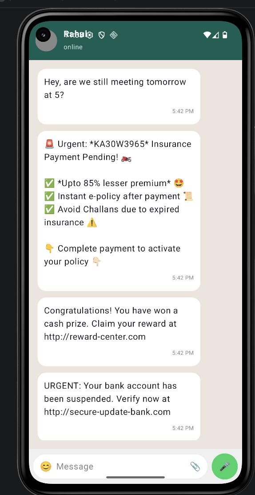
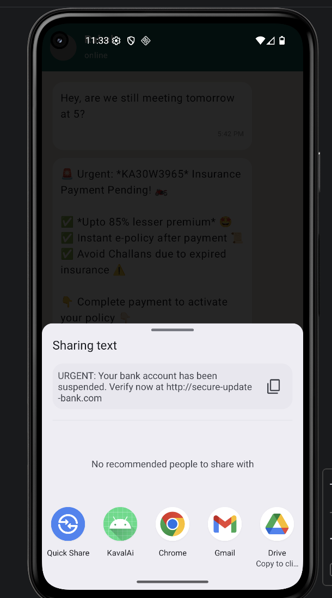
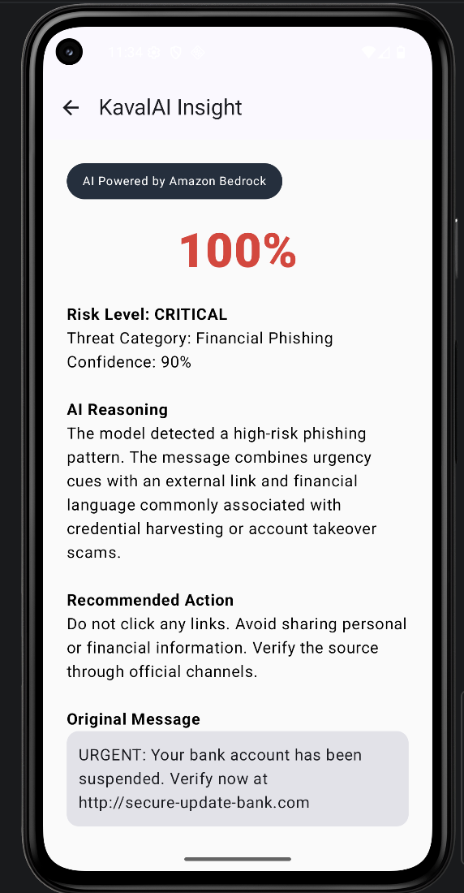

# KavalAI  
### AI‑Powered Scam Detection for Messaging Platforms

KavalAI is a mobile prototype that helps users detect phishing and scam messages directly from messaging platforms such as WhatsApp and SMS.  
The application allows users to share suspicious messages through Android’s native share system and receive instant risk analysis along with safety guidance.

The goal of KavalAI is to make scam detection **accessible, fast, and integrated into everyday messaging workflows.**

---

# Problem

Scam and phishing attacks are rapidly increasing across messaging platforms. Many users struggle to identify malicious messages that manipulate them using urgency, fake financial offers, or malicious links.

Existing solutions often require manual checks or external tools, which interrupt the user's normal communication workflow.

---

# Solution

KavalAI integrates directly with Android’s share system so users can instantly analyze suspicious messages without leaving their messaging app.

The system analyzes message content for common scam indicators and returns a structured risk report that includes:

- Risk Level
- Threat Category
- Confidence Score
- AI Reasoning
- Recommended Safety Actions

This helps users quickly determine whether a message may be dangerous.

---

# Key Features

### Android Share Integration
Users can share suspicious messages directly from messaging apps like WhatsApp or SMS to KavalAI using Android’s native Share Intent system.

### AI‑Based Scam Detection
The system analyzes messages for scam indicators such as malicious links, urgency language, and financial trigger words.

### Risk Classification
Messages are categorized into clear risk levels:

- Low Risk  
- Caution  
- Critical  

### Threat Identification
The system identifies the type of scam attempt such as phishing or financial fraud.

### Safety Guidance
Users receive clear recommendations on how to safely respond to suspicious messages.

---
# Screenshots

<p align="center">
  
  
  
</p>

<p align="center">
  <b>Chat Interface</b> &nbsp;&nbsp;&nbsp;&nbsp;
  <b>Share Message</b> &nbsp;&nbsp;&nbsp;&nbsp;
  <b>AI Risk Analysis</b>
</p>

---
# How It Works

1. User receives a suspicious message.
2. User long presses the message and selects **Share**.
3. User selects **KavalAI** from the share menu.
4. The message is sent to the KavalAI application.
5. The analysis engine evaluates the message for scam indicators.
6. The system generates a risk score and threat classification.
7. The user receives a structured risk report and safety guidance.

---

# Proposed Architecture

The current prototype performs message analysis locally.  
The production architecture is designed to integrate AWS services for scalable AI inference.

```
Mobile User
     ↓
KavalAI Android App
     ↓
API Gateway
     ↓
AWS Lambda
     ↓
Amazon Bedrock (Claude Model)
     ↓
AI Scam Analysis
     ↓
Structured Risk Response
     ↓
Displayed in Mobile App
```

---

# Technology Stack

### Mobile Application
- Kotlin
- Android Studio
- Jetpack Compose

### AI / Backend (Planned Production)
- Amazon Bedrock
- AWS Lambda
- API Gateway

### Development Tools
- Git
- GitHub

---

# Prototype Status

Current prototype includes:

- Android mobile interface
- WhatsApp‑style message interaction
- Android Share Intent integration
- Local scam analysis engine
- Risk classification system

The prototype currently simulates AI reasoning locally while the production version will integrate **Amazon Bedrock foundation models** for contextual message analysis.

---

# Future Improvements

- Integration with Amazon Bedrock for real AI inference
- Multi‑language scam detection
- SMS and notification listener integration
- Scam knowledge base using Retrieval‑Augmented Generation (RAG)
- Enterprise fraud detection APIs

---

# Author

Harini Prabakaran, Samiksha Rao
KavalAI Prototype Project
